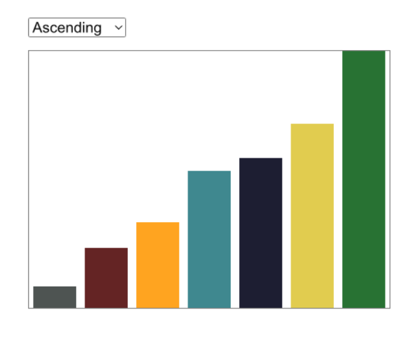

# BarCharts

This project is a simple, dynamic bar chart visualization built with React.


## Getting Started

To get started with this project, clone the repository and install the dependencies:

```bash
git clone https://github.com/your-repo/BarCharts.git
cd BarCharts
npm install
```

## Running the Project

You can start the development server with:

```bash
npm start
```

This will start the server on `localhost:3000`.

You can build the project for production with:

```bash
npm run build
```

## Dependencies

This project uses the following dependencies:

- `react`: ^18.0.0
- `react-dom`: ^18.0.0
- `react-scripts`: ^5.0.0

